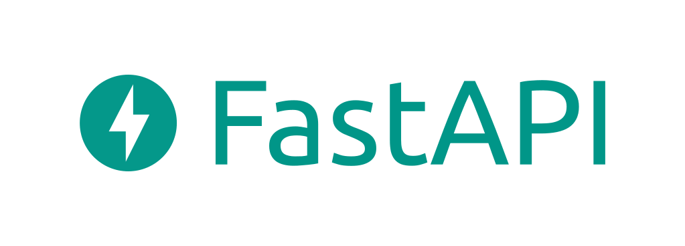
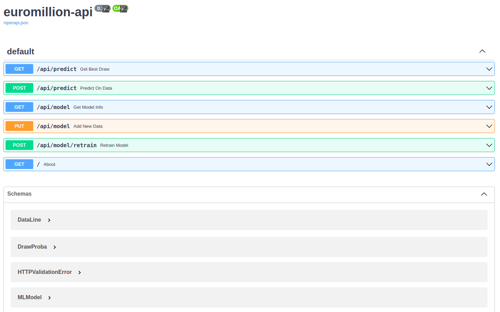
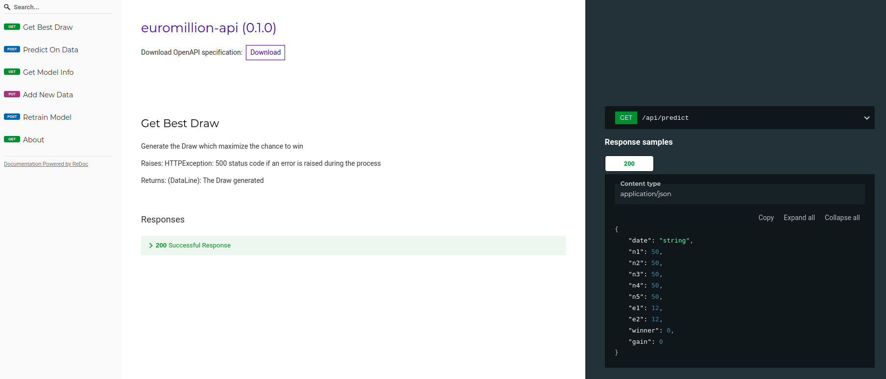

# euromillion-api




## Overview

This is an AI-based project to determine which lotto draw is most likely to come out.
The dataset used for training the model is available in the [data](data/) directory of this git repository.

This project use [FastAPI](https://fastapi.tiangolo.com/) framework to create the API which interact with the [scikit-learn](https://scikit-learn.org/stable/) AI-model 

## Installation

To install all the requirements, use the package manager [pip](https://pip.pypa.io/en/stable/) and type this in your terminal.

```bash
pip install -r /path/to/requirements.txt
```

## Usage

First of all, you have to launch the app :
```bash
uvicorn app.main:app --reload
```
This command should create the local server on your computer with the app running on it.

Then, to visualize and test all the endpoints and the API routes available, go to [http://localhost:8000/docs](http://localhost:8000/docs) and you should see the swagger page like this :




You can also see a more detailled documentation at [http://localhost:8000/redoc](http://localhost:8000/redoc) like :


